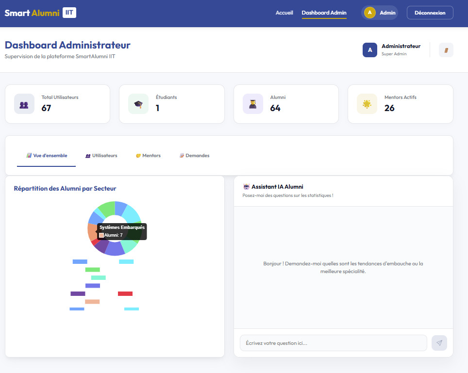
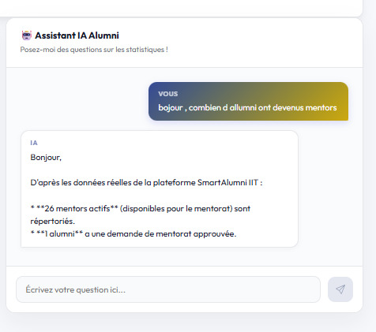
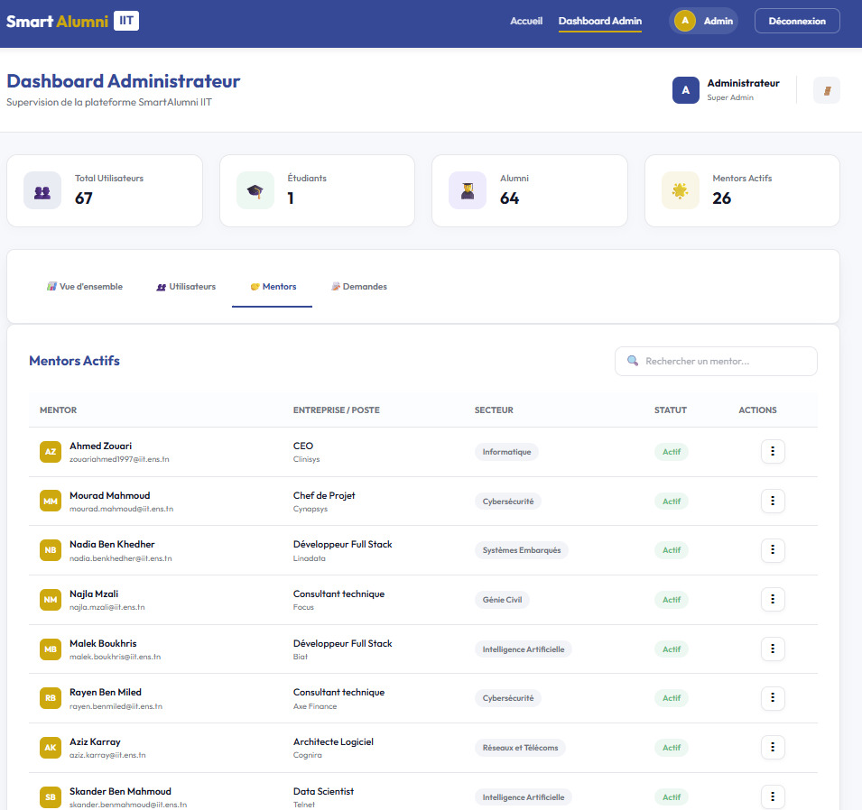
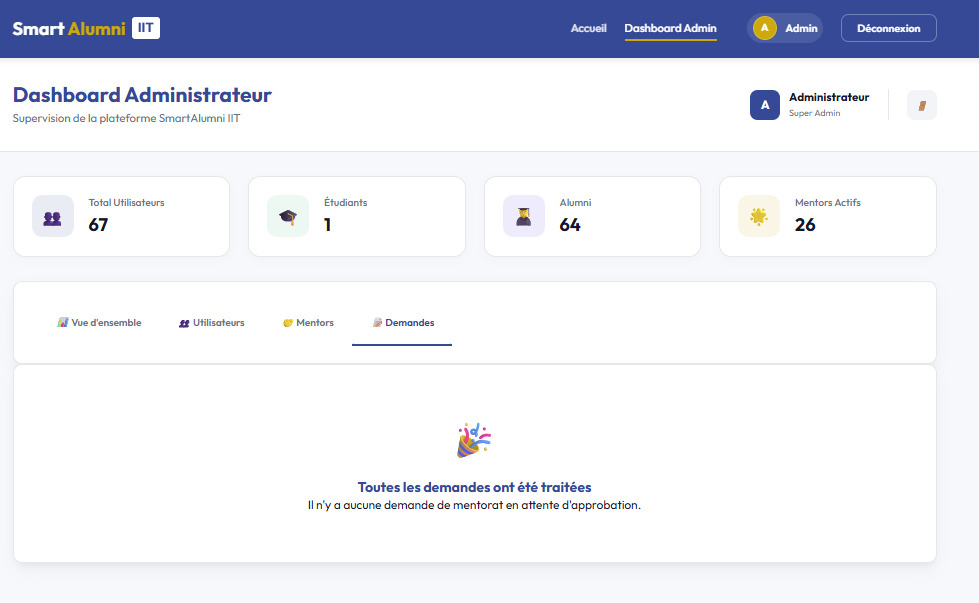

## 🖼️ Application Preview

### 🛡️ Administrator Dashboard

The administrator can monitor platform activity, users, mentors and mentorship requests.

### 🤖 AI Assistant

The administration dashboard includes an AI assistant for querying platform statistics.

### 👥 User Management

Administrators can browse and manage platform users.

### 🔎 Mentor Discovery

Users can search for mentors by keywords, sector and country.

### 📄 AI-Assisted CV Analysis

Users can upload a CV, analyze its content and validate the extracted information before updating their profile.

### 💬 Messaging

Students and mentors can communicate after a mentorship request is accepted.

### 🎓 Student Experience

Students can track their mentorship requests and search for suitable mentors.

## 📸 More Screenshots

<b>🛡️ Administrator Interface — 5 screenshots</b>

 

### Dashboard Overview

### AI Assistant

### User Management

### Mentor Management

### Mentorship Requests

<b>🎓 Alumni Interface — 5 screenshots</b>

 

### Mentor Search

### Mentorship Requests

### AI-Assisted CV Analysis

### Messaging

### Profile

<b>🤝 Mentor Interface — 5 screenshots</b>

 

### Mentorship Requests

### Mentor Search

### AI-Assisted CV Analysis

### Messaging

### Profile

<b>🎓 Student Interface — 4 screenshots</b>

 

### Mentorship Requests

### Messaging

### Profile

### Find a Mentor

